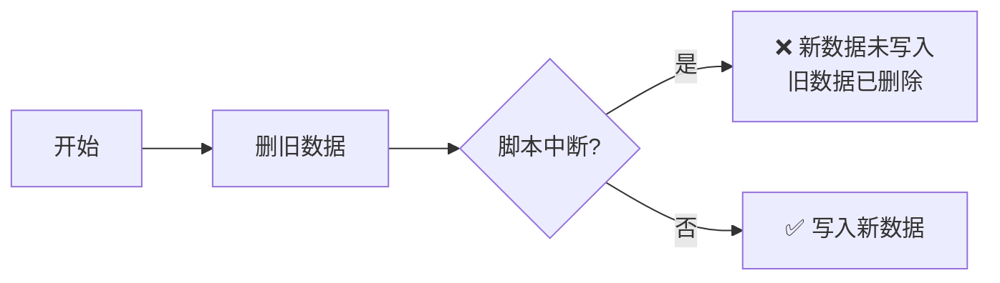

# FGI 项目代码审计报告

> **工具**：阿里 OpenCode Review (`ocr scan` 1.7.17)  
> **模型**：deepseek-v4-pro  
> **扫描范围**：项目全部 110 个文件  
> **会话 ID**：67378893-05d7-4056-bba7-85c45e075881  
> **扫描时间**：2026-07-27 15:32 ~ 16:08 UTC（约 36 分钟）  
> **LLM 请求数**：408 次（0 次失败）  

---

## 概述

本次审计对 FGI 项目所有源文件、测试文件、配置文件和文档进行了全量扫描。共发现 **7 大类问题**，覆盖安全漏洞、数据一致性缺陷、代码质量和工程实践等方面。

---

## 一、安全问题

### 1.1 跨站脚本（XSS）与注入漏洞

**严重程度**：🔴 高危  
**影响范围**：前端 3 个文件 + 后端 1 个文件 + CI 配置

| 文件 | 问题描述 | 行号/位置 |
|---|---|---|
| `docs/scripts/components.js` | 16 处 `innerHTML` 直接拼接数据，未转义 | `renderAnchor`, `renderExtremeSignals`, `renderSignalReport`, `renderSignalRef`, `renderDashboard` |
| `docs/scripts/charts.js` | tooltip formatter 直接拼接数据到 HTML | 多处 tooltip 回调 |
| `fgi/output/renderer.py` | HTML 表格拼接动态值时未用 `html.escape` | `decision_matrix_section`, `build_fgi_markdown` |
| `.github/workflows/daily_update.yml` | 用户输入直接拼入 shell 命令 | 行 36-40（date 参数注入） |

**影响**：攻击者可注入恶意脚本或命令。

---

### 1.2 CI/CD 工作流风险

**文件**：`.github/workflows/daily_update.yml`

| 问题 | 详情 |
|---|---|
| 命令注入 | `workflow_dispatch.inputs.date` 直接拼入 shell |
| 无超时 | job 缺少 `timeout-minutes`，可能无限占用运行器 |
| 无并发控制 | 双 cron + 手动触发可能同时运行，导致 Git 冲突 |
| 依赖未缓存 | 每次运行重新 `pip install` |

---

## 二、数据一致性问题

### 2.1 数据库上下文管理器缺陷

**严重程度**：🔴 高危  
**文件**：`fgi/storage/database.py:35-38`

```python
def __exit__(self, exc_type, exc_val, exc_tb):
    if exc_type is not None:
        self._connection.rollback()
    self.close()  # ← 没有 commit()！
```

**影响**：所有 `with Database() as db:` 块内的写入操作在正常退出时**静默丢弃**，除非各调用方手动调了 `db.commit()`。这是基础设施级缺陷，可能导致每日 FGI 数据写入丢失。

---

### 2.2 写入操作缺少 commit

| 文件 | 具体问题 |
|---|---|
| `fgi/calculator/fgi.py` | `_apply_forward_fill` 已提交一次，后续 `upsert_raw_data` 和 `upsert_score` 又各自提交，事务边界混乱；中途失败可能导致部分持久化 |
| `scripts/backfill_f1_margin.py` | 先删后插无事务回滚，中断后数据全丢 |
| `scripts/backfill_f1_market_cap.py` | 同上 |
| `scripts/backfill_f3_flow.py` | 同上 |

### 2.3 回填脚本事务原子性缺失



所有 `backfill_*.py` 脚本均采用"先删后插"模式但无事务包裹。

---

## 三、异常处理缺陷

### 3.1 静默吞异常

| 文件 | 行号 | 问题 |
|---|---|---|
| `fgi/collector/tencent_source.py` | except 块 | 捕获异常后仅 `pass`，不记录日志 |
| `fgi/collector/fallback.py` | except 块 | 吞异常继续 |
| `fgi/output/alert.py` | except 块 | 异常时保守处理但无日志 |
| `fgi/output/signal_report.py` | except 块 | 多个宽泛吞异常 |
| `fgi/collector/trading_calendar.py` | except 块 | 失败时静默返回 None |

### 3.2 缺少异常保护的脆弱代码

| 文件 | 问题 |
|---|---|
| `fgi/calculator/momentum/m1.py` | `run()` 方法对 `fetch_data` 无异常处理，API 失败直接崩溃 |
| `fgi/calculator/funding/f3.py` | 复杂计算无 try/except |
| `docs/scripts/main.js` | `_doSwitchDate` 无错误边界，render 异常导致 UI 卡死 |

---

## 四、防御性编程不足

### 4.1 空值 / NaN 未处理

| 文件 | 问题 |
|---|---|
| `fgi/calculator/valuation/v1.py` | `1.0 / pe_ttm` 无除零检查，产生 `inf` 并写入数据库 |
| `fgi/calculator/momentum/m2.py` | `up_num + down_num` 可能为 0，产生 NaN |
| `fgi/common/utils.py` | MAD 计算除零返回空 Series |
| `docs/scripts/components.js` | render 函数未校验 `data` 参数是否为 null |
| `docs/scripts/charts.js` | `document.getElementById` 可能返回 null，无检查 |

### 4.2 硬编码与脆弱假设

| 文件 | 假设 | 风险 |
|---|---|---|
| `fgi/calculator/funding/f1.py` | 市值单位是"亿元"（`* 1e8`） | 数据源换格式则数字差 1e4 |
| `fgi/calculator/funding/f1.py` | 日期格式看第一行判断 | 第一行空/不同格式全崩 |
| `fgi/calculator/valuation/v2.py` | `lookback_days * 1.5` 放大因子 | 足够但无依据魔法值 |
| `docs/scripts/components.js` | 前瞻天数 `[5, 20, 60]` 硬编码两处 | 改一处忘另一处 |

### 4.3 NaN / inf 数据库污染

```
v1.py: 1.0 / (PE == 0) → inf
    → erp_history batch 只 dropna，不清理 inf
    → inf 写入 raw_data
    → 后续百分位计算产生 NaN 或错误值
```

---

## 五、代码质量问题

### 5.1 松散相等比较

违反项目严格相等规范，在以下文件中使用了 `==` / `!=`：

| 文件 | 示例 |
|---|---|
| `docs/scripts/main.js` | `fgi == null`, `hs != null` |
| `docs/scripts/charts.js` | `v != null`（8 处）|
| `docs/scripts/components.js` | `d.mean != null`（5 处） |

**注意**：`== null` 在 JS 中同时检查 `null` 和 `undefined` 是惯用写法，但其余 `==` 应替换。

### 5.2 死代码

| 文件 | 行号 | 内容 |
|---|---|---|
| `docs/scripts/main.js` | 151 | `let historyChartInited = false` 声明后从未使用 |
| `fgi/output/backfill.py` | 多处 | 未调用函数 |
| `fgi/output/renderer.py` | 85 | `score_bar` 函数未使用 |

### 5.3 模块级副作用

| 文件 | 问题 |
|---|---|
| `fgi/config/settings.py` | import 时创建目录（`DATA_DIR.mkdir(exist_ok=True)`） |
| `fgi/output/backtest.py` | 顶层 `raise NotImplementedError` 导致导入即崩溃 |

### 5.4 类型标注错误

- `fgi/calculator/momentum/m3.py`：返回类型标注与实际不符

---

## 六、前端图表内存泄漏

### 6.1 ECharts 实例未销毁

**严重程度**：🟡 中危

```
charts.js:   echarts.init() 被调用 5 次
              .dispose() 被调用 0 次
main.js:     _doSwitchDate() 每次创建新图表，覆盖旧引用
             旧实例成为内存垃圾
```

### 6.2 事件监听器未清理

- `charts.js:initTrendChart()` 绑定 `change` 事件，无 `removeEventListener`

---

## 七、并发与资源管理

### 7.1 竞态条件

| 文件 | 问题 |
|---|---|
| `fgi/collector/trading_calendar.py` | `load()` 方法 check-then-act 非线程安全 |
| `fgi/collector/mootdx_source.py` | 创建客户端时无锁保护 |

### 7.2 数据库连接泄漏

| 文件 | 模式 | 风险 |
|---|---|---|
| `scripts/backfill_f1_margin.py` | `db.connect()` 无 `finally` | 异常时连接泄漏 |
| `scripts/recompute_v2.py` | 同上 | 同上 |

### 7.3 磁盘缓存写入非原子

- `trading_calendar.py`：磁盘缓存写入中断可能产生损坏文件

---

## 八、逐文件审查记录

### `docs/scripts/components.js`（评级：红）

| 关注点 | 说明 |
|---|---|
| XSS | 16 处 `innerHTML` 拼接外部数据，无转义 |
| 空值防护 | `renderExtremeSignals` 解构 `[, label, score]` 假设至少 3 元素 |
| 全局依赖 | `setupDatePicker` 直接使用 `state.allDates`，未检查 state |
| 魔法数字 | 前瞻天数 `[5, 20, 60]` 硬编码 2 处 |

### `docs/scripts/charts.js`（评级：红）

| 关注点 | 说明 |
|---|---|
| 图表泄漏 | 5 次 `init` / 0 次 `dispose` |
| XSS | tooltip formatter 拼接数据到 HTML |
| 空数据崩溃 | `closeVals` 为空时 `Math.min` 返回 Infinity |
| DOM 未检查 | `getElementById` 可能返回 null |

### `docs/scripts/main.js`（评级：黄）

| 关注点 | 说明 |
|---|---|
| 松散相等 | `!=` / `==` 多处 |
| 死代码 | `historyChartInited` 未使用 |
| 无错误边界 | `_doSwitchDate` 无 try/catch |
| 图表泄漏 | 切换时不 dispose 旧实例 |

### `fgi/storage/database.py`（评级：红）

| 关注点 | 说明 |
|---|---|
| **致命缺陷** | `__exit__` 不 commit，写入静默丢失 |
| SQL 注入风险 | `upsert_score` 动态拼接键名到 SQL |
| 连接检查 | `get_status` / `get_missing_dates` 无连接检查 |

### `fgi/calculator/valuation/v1.py`（评级：黄）

| 关注点 | 说明 |
|---|---|
| inf 污染 | `1.0 / 0` 产生 `inf` 传播到数据库 |
| 断言风险 | 生产模式 `-O` 下 `assert` 被移除 |
| 未清理 | `erp_history` 写入前未清理 inf 值 |

### `fgi/calculator/funding/f1.py`（评级：黄）

| 关注点 | 说明 |
|---|---|
| 空 DF | `margin_df.iloc[0]` 在空 DF 时 IndexError |
| 日期推断 | 仅看第一行判断日期格式 |
| 单位硬编码 | `market_cap * 1e8` 假设亿元 |
| 列名硬编码 | `"融资余额"` 等中文列名硬编码 |

### `fgi/common/utils.py`（评级：黄）

| 关注点 | 说明 |
|---|---|
| zscore 除零 | 窗口 std=0 时返回 ±inf |
| MAD 除零 | 全值相同除以零 |
| 缓存并发 | `_PERCENTILE_CACHE` 无锁 |

### `fgi/output/renderer.py`（评级：黄）

| 关注点 | 说明 |
|---|---|
| XSS | HTML 拼接动态值无 `html.escape` |
| 溢出 | `score_bar` 未限制 filled 在 [0, width] |

### `.github/workflows/daily_update.yml`（评级：黄）

| 关注点 | 说明 |
|---|---|
| 命令注入 | `${{ inputs.date }}` 拼入 shell |
| 无超时 | job 缺 `timeout-minutes` |
| 无并发 | 双 cron + 手动可能冲突 |
| 无缓存 | 每次 `pip install` |

---

## 九、Quick Wins

按实施难度排序：

| 优先级 | 改动 | 文件 | 估算 |
|---|---|---|---|
| P0 | `__exit__` 补 `commit()` | `database.py` | 1 行 |
| P1 | 后端 HTML 转义 `html.escape` | `renderer.py` | 5 处 |
| P1 | 前端 `escapeHtml` 工具函数 | `components.js` | 1 函数 + N 处 |
| P1 | ECharts `dispose` | `charts.js` | 5 处各 +2 行 |
| P2 | 删除死代码 | `main.js`, `renderer.py` | 2 行 |
| P2 | 松散相等替换（非 `== null`） | `*.js` | 逐处检查 |
| P2 | 前端错误边界 | `main.js`, `components.js`, `charts.js` | 各 +3 行 |
| P2 | 回填脚本事务保护 | 3 个 `backfill_*.py` | 每文件 5 行 |
| P3 | workflow 注入防护 | `daily_update.yml` | 2 处 |
| P3 | 硬编码天数抽取 | `components.js` | 2 处 |

---

## 十、扫描统计

| 指标 | 值 |
|---|---|
| 扫描文件数 | 110 |
| LLM 请求/响应 | 408 对 |
| 工具调用 | 221 次 |
| LLM 失败 | 0 |
| 总耗时 | ~36 分钟 |
| 扫描模式 | `full_scan`（非 diff 模式）|

---

*本报告由 `ocr scan` 自动生成，汇总为可读的 Markdown 文档。  
原始会话日志：`docs/audits/67378893-05d7-4056-bba7-85c45e075881.jsonl`*
